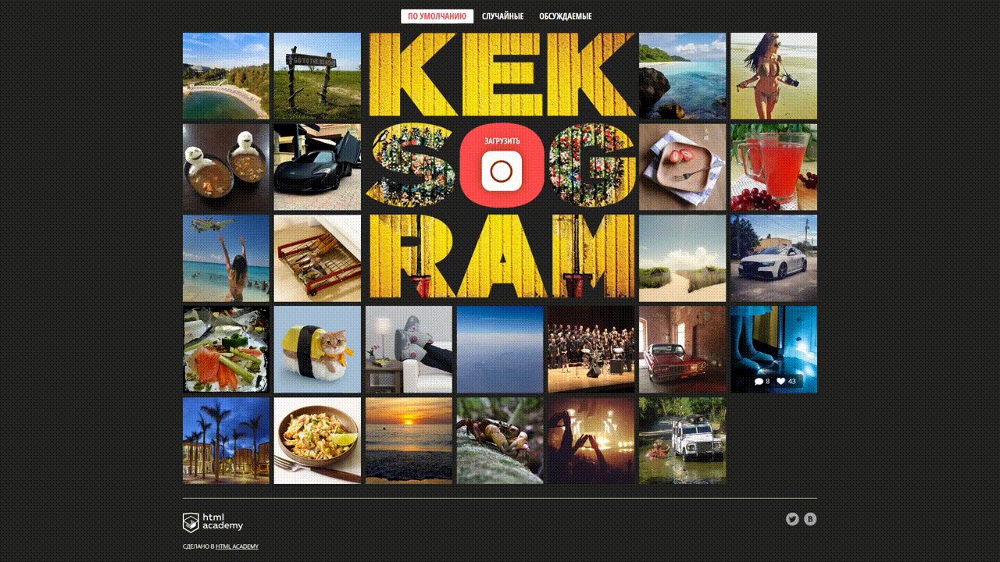
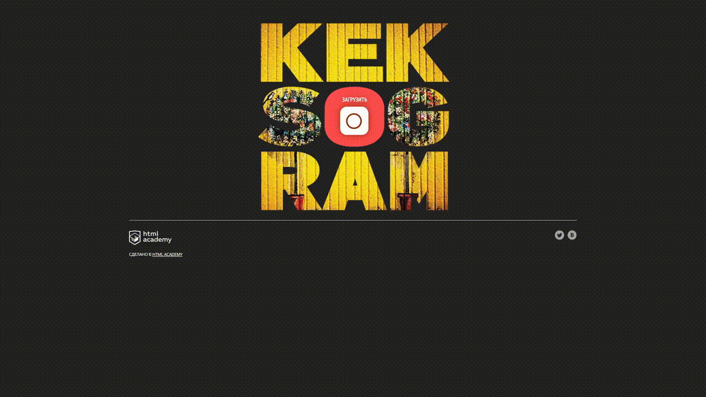
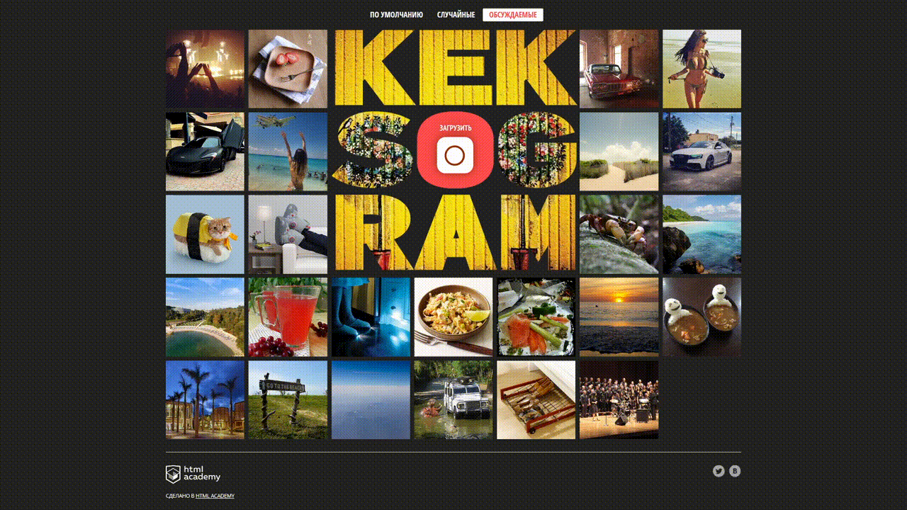

  

# О проекте

Кекстаграм - это веб приложение с возможностью просмотра и загрузкой фотографий. Разработка выполнена на нативном JS, без использования фреймворков.

Открыть страницу: https://linacor.github.io/kekstagram/

# Функциональность
Код разбит на отдельные модули, что обеспечивает более простую и понятную структуру. Подключение модулей осуществляется через файл main.js.
Реализовано:
- получение данных с сервера (AJAX запрос),
- демонстрация баннера в случае ошибки ответа сервера,
- отрисовка миниатюр фотографий с информацией о количестве лайков и комментариев.

Функции для пользователя:
- фильтрация изображений по категориям (по умолчанию, случайные, обсуждаемые),
- просмотр миниатюры в отдельном модальном окне:
    - просмотр и загрузка комментариев,
    - просмотр хэштегов и количества лайков.
- загрузка нового изображения:
    - увеличение / уменьшение масштаба загруженного изображения,
    - выбор фильтра и его интенсивности,
    - добавление хэштегов,
    - добавление комментария,
    - валидация формы перед отправкой с помощью библиотеки Pristine,
    - демонстрация попапа в случае ошибки отправки.

# Демонстрация
## Desktop version
1. Просмотр страницы

2. Фильтрация по категориям

3. Ошибка загрузки с сервера

4. Просмотр миниатюры

5. Загрузка нового изображения

6. Валидация формы

